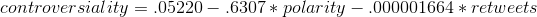
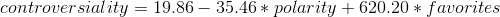

# Twitter Persona Likability

> Determine whether or not a Twitter persona is controversial or not with Python.

This project was for CSE 60437 - Social Sensing and Cyber-Physical Systems at the University of Notre Dame.

## Inspiration

## Timeline

### Pre-Midterm

1. Determined which Twitter personas we would follow, 20 from each category: celebrities, athletes, and musicians. The subjects were chosen with a degree of subjectivity, but were reinforced by classmates and online articles/surveys.

2. Figured out data collection techniques using two different scripts: collect_tweets_from_user.py and collect_tweets_about_user.py. These were run with a degree of regularity, and the results were written to files, user_tweets_from.csv and user_tweets_about.csv, respectively.

3. Implemented ternary graph (individual tweets and averaged) for the "celebrity" category. The metric for determining if an individual was controversial was what we called RFR (reactions per follower ratio), which is essentially the number of retweets and favorites divided by the sending user's follower count.

Note: At this point in time, the likability/controversiality of an individual has nothing to do with the content of his or her tweets, a feature explored in the next part of the project.

### Post-Midterm

1. Implemented ternary graphs (individual tweets and averaged) for the remaining two "industry" categories (athletes & musicians).

2. Devised our first non-trivial 'controversiality' ratio, using our user_tweets_about data in R and RStudio. We quickly discovered that RFR is not the best indicator of controversiality; features extracted from the user_tweets_from.csv. In other words, what an individual tweets his or herself is of little importance. Using the 'leaps' package in R, we conducted a bidirectional feature subset search on the user_tweets_about data. For individual tweet data, we finalized a formula for "controversiality" that looked like this: 



The development of this likability metric was one of the main objectives of this project. The analysis and results from this can be seen in the section below.

3. Revised this first ratio to apply to aggregate data; we again did this in RStudio, and the final formula for "controversiality" for aggregated/average tweet data looked like this:



4. TPOTClassifier.

## Running the Code

### Grouped by Individual Version

The first graph demonstration encompasses every tweet we've collected in our assessment of whether or not an individual is controversial or not. To see the graphs produced using RFR and this aforementioned 'controversiality' ratio, run the following code to generate an app hosted on localhost:8050. Use the dropdown menu and search functionality to select the person(s) you are most interested in. The second of the two graphs shows controversiality plotted in time.

```
python tpl-individual-combined.py
```

### Results

In this case, the confusion matrix below shows how adequately our first 'controversiality' ratio performed on individual tweets. 


### Grouped by Industry Version

The second graph demonstration shows an average of tweets we've collected for categories of individuals. Again the graphs use RFR and the 'likability' ratio; the results be seen by running the following code. Use the dropdown menu and search functionality to select the category of Twitter personas you are most interested in.

```
python tpl-industry-combined.py
```

### Results

